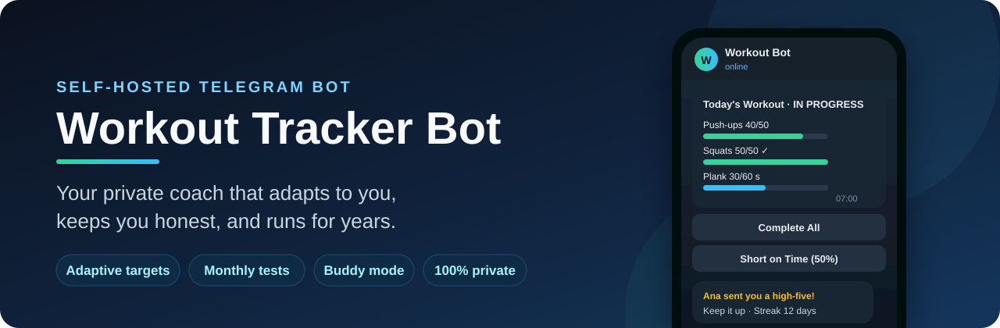
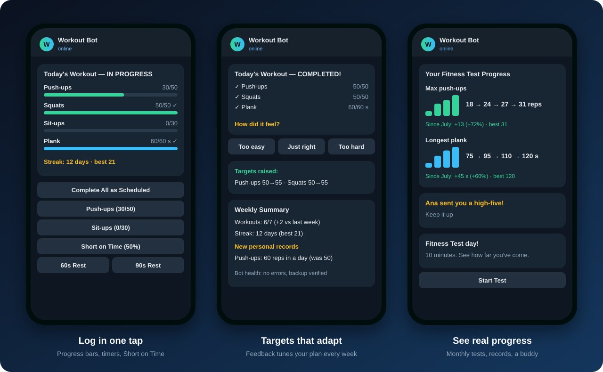
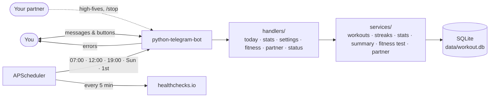

<p align="center">
  
</p>

<p align="center">
  
  
  
  
  
</p>

<p align="center">
  <b>A self-hosted Telegram bot that turns daily bodyweight workouts into a habit,<br>
  adapts your targets as you get stronger, and proves it with real numbers.</b>
</p>

<p align="center">
  <a href="#-quick-start">Quick start</a> ·
  <a href="#-what-it-does">Features</a> ·
  <a href="#-commands">Commands</a> ·
  <a href="#-run-it-247-on-a-server">Deploy</a> ·
  <a href="#-faq">FAQ</a>
</p>

---

## 💡 Why this bot?

Most workout apps want a subscription, an account, and your data. This one lives in the chat app you already open fifty times a day, and **everything stays on your own server**.

| What you get | How |
| :--- | :--- |
| 🎯 **It adapts to you** | Tell it a workout was *too easy* or *too hard* and your targets change. After a break it eases you back in at 70% → 85% → 100%. |
| 🧪 **It proves you're changing** | A 10-minute fitness test on the 1st of every month: *push-ups 18 → 24 → 31*. Real numbers, not just streaks. |
| 🤝 **It keeps you honest** | Invite a friend as your accountability partner: they get your weekly summary and can send you 👏 high-fives. |
| 🛡 **It runs for years** | Verified backups, error reports in Telegram, an optional outside alarm if the server dies, and 292 automated tests. |
| 🔒 **It's yours** | You plus only the people you invite, a local SQLite file, no AI, no API keys, no tracking. |

<p align="center">
  
</p>

---

## 📅 A week with the bot

| When | What happens |
| :--- | :--- |
| **07:00** every day | Today's workout arrives with progress bars. Log it in one tap, or tap **⏱ Short on Time** for a 50% version that still counts for your streak. |
| **After a workout** | *How did it feel?* 😴 / 👌 / 🥵. The bot tunes your next targets. |
| **19:00** if not done | A gentle streak-saver nudge listing only what's left. |
| **Sunday 20:00** | Weekly summary: workouts vs last week, per-exercise totals, new personal records, bot health. Also sent to your partner if you want. |
| **1st of the month** | 🧪 Fitness test day. Results are compared with last month and your progress chart grows. |
| **Going on vacation?** | `/pause` freezes your streak and stops reminders. They restart automatically, with a *Welcome back*. |

---

## ✨ What it does

### 🏋️ Train
- **One-tap logging:** *Complete All*, `+1 / +5 / +10 / +25` buttons, exact amounts, skip.
- **Built-in timers:** 60 s / 90 s rest and plank timers that ping you when time is up (they survive restarts).
- **⏱ Short on Time:** halves today's remaining targets. It still counts, and can be undone.
- **Snooze 1h:** re-sends today's workout an hour later (skipped if you already finished).

### 🎯 Adapt
- **Difficulty feedback:** *Too easy* twice in a row → targets +10%. *Too hard* → −10% right away.
- **Comeback ramp:** after 4+ missed planned days (vacations included), workouts ease back in at 70% → 85% → 100%.
- **Optional auto-progression:** +X% after N full-target workouts in a row. Reduced days never count.

### 📈 See progress
- **🧪 Monthly fitness test:** max push-ups, squats in 2 minutes (with timer), longest plank, optional pull-ups. Guided one test at a time; 🏅 marks personal bests; `▁▄█ 18 → 24 → 31` trend charts.
- **📆 Weekly summary:** this week vs last week, totals per exercise, new records.
- **📅 4-week heatmap:**
  ```text
   M   T   W   T   F   S   S
  🟩  🟩  🟩  🟩  🟩  ⬜  🟩
  🟩  🟩  🟨  🟩  🟦  🟦  🟦
  🟩  🟩  ⏳  ▫️  ▫️  ▫️  ▫️
  🟩 Done  🟨 Partial  ⬜ Rest  🟦 Paused  🟥 Missed
  ```
- **🔥 Streaks** that rest and paused days never break, **🏆 badges**, period stats, and **📤 CSV export**.

### 👥 Train together (crew mode)
Invite your brother (or up to 5 friends) with a single-use link. Everyone gets **their own** workouts, targets, reminder time, timezone and streak, and then:
- **Live feed:** *"🏁 Andrei just finished today's workout. Your move 👀"* the moment it happens.
- **⚔️ `/duel` scoreboard:** today side by side (progress, reps, streaks, wake-ups) plus a **crew streak** of days everyone trained.
- **😈 Roast / 💪 Hype buttons:** savage, friendly or off (each person decides what they receive). Roasting someone who's already done while you aren't backfires.
- **🤖 Auto-roast at 21:00** if a crew mate trained and you didn't.
- **☀️ Wake-up challenge (`/wake`):** at your wake time, tap the right number within 10 minutes. The crew sees *on time ✅*, *42 min late 🐢* or *slept through 😴*.
- **🏆 Weekly points (`/points`):** workout +10, full targets +5, woke on time +5, challenge +15, test PR +20, forfeit done +5. Sunday 20:30 the winner is crowned 👑 and picks the loser's **forfeit** (50 extra push-ups, cold shower...).
- **🎯 Challenges (`/challenge`):** *"100 push-ups today"*, *"full workout before 09:00"*... Accept or 🐔 chicken out. Resolved automatically as you log, or at 23:00.

### 📱 In the Mini App
- **Everything without the chat:** settings (reminder and wake times, pause, roast level), an exercise editor (add, remove, targets, days), tap a number to type the exact amount with **Undo**, and the monthly fitness test with a built-in timer.
- **A live duel:** a fight log of what your crew does (react with 🔥💀😂🐔👑), write your own roasts, and **ghost pace**: *"yesterday at this time Andrei had 120 reps, you have 100"*.
- **Anime progression:** XP and ranks from E to S with a rank-up animation, unlockable mascot gear (hair, headbands, auras), and monthly **seasons** with a champion title.
- **Body change:** skill ladders (push-ups → diamond → archer...), weekly weight and waist trends, and **private** progress photos with then-and-now. Tap any calendar day to see what you did.

### 🤝 Stay accountable
- **Accountability partner** (owner only): a single-use invite link (48 h). Your friend gets only what you tick: weekly summary ✅, fitness test results ✅, and optionally an alert after 3 missed workouts in a row (you're warned the morning before).
- They can send one 👏 high-five per day, and they can't see or change anything else. Either of you can end it anytime.
- **🏖 Vacation / sick pause:** 3 days, 1–2 weeks or custom (up to 60 days).

### 🛡 Run itself
- **Verified backups:** weekly to your Telegram chat, each one restore-tested against the live data; the last 10 are kept on disk.
- **Error reports in Telegram:** rate limited, so you never need to read server logs.
- **📡 Outside alarm:** pings a free [healthchecks.io](https://healthchecks.io) check, which emails you if the server goes silent.
- **`/status` health check:** uptime, running version, button clicks received, next reminders, last backup.
- **"Bot started" message** on every restart, so a crash loop is obvious.

---

## 🚀 Quick start

**You need:** Python 3.11+, a bot token from [@BotFather](https://t.me/botfather), and your numeric Telegram ID from [@userinfobot](https://t.me/userinfobot).

```bash
git clone https://github.com/vicuvi1/Sport-Bot-Telegram-.git
cd Sport-Bot-Telegram-
python3 -m venv .venv && source .venv/bin/activate   # Windows: .venv\Scripts\Activate.ps1
pip install -r requirements.txt
cp .env.example .env                                  # then fill it in (below)
python main.py
```

```env
TELEGRAM_BOT_TOKEN=1234567890:ABCdefGHIjklMNOpqrsTUVwxyz
TELEGRAM_USER_ID=123456789
TIMEZONE=Europe/Chisinau
WORKOUT_TIME=07:00
HEALTHCHECK_URL=            # optional, see "Outside alarm" below
```

Open your bot in Telegram and send **`/start`**. That's it. 🎉

---

## 🕹 Commands

| Command | What it does |
| :--- | :--- |
| `/today` | Today's workout with progress bars and logging buttons |
| `/progress` · `/stats` | Stats for today, this week, this month, all time |
| `/history` | 4-week heatmap and recent workouts |
| `/summary` | This week's summary on demand |
| `/test` | Monthly fitness test and your progress history |
| `/crew` · `/duel` | Your crew, invites, roast / hype · today's scoreboard |
| `/wake` | Wake-up challenge: on/off and time |
| `/points` · `/challenge` | Weekly points and forfeits · challenge a crew mate |
| `/partner` | Invite or manage your accountability partner (owner) |
| `/pause` | Vacation / sick pause |
| `/badges` | Milestones and badges |
| `/settings` | Reminder time, timezone, exercises, targets, progression |
| `/export` · `/backup` | CSV export · database backup sent to the chat |
| `/status` | Health check |
| `/cancel` · `/help` | Leave a prompt · help |

---

## 🐧 Run it 24/7 on a server

<details>
<summary><b>Ubuntu + systemd setup</b> (auto-start on boot, auto-restart on crash)</summary>

```bash
sudo mkdir -p /opt/workout-bot && sudo chown -R $USER:$USER /opt/workout-bot
git clone https://github.com/vicuvi1/Sport-Bot-Telegram-.git /opt/workout-bot
cd /opt/workout-bot
python3 -m venv .venv && ./.venv/bin/pip install -r requirements.txt
cp .env.example .env && nano .env

sudo cp workout-bot.service /etc/systemd/system/   # edit User=/Group= if not "ubuntu"
sudo systemctl daemon-reload
sudo systemctl enable --now workout-bot
journalctl -u workout-bot -f                        # live logs
```

**Updating:** `git pull && sudo systemctl restart workout-bot`. The database upgrades itself on startup and keeps your history.
</details>

<details>
<summary><b>📡 Outside alarm</b> (get an email if the server dies)</summary>

1. Create a free check at [healthchecks.io](https://healthchecks.io): **period 5 minutes**, **grace 15 minutes**, email notifications on.
2. Put its ping URL (`https://hc-ping.com/…`) in `HEALTHCHECK_URL` in `.env` and restart the bot.
3. `/status` shows **📡 Outside alarm: ✅ OK** within a minute. If the bot can't reach Telegram it pings `/fail`, so you're alerted even while the server is up.
</details>

<details>
<summary><b>📱 Mini App (optional): a real app screen inside Telegram</b></summary>

The bot serves the app on `127.0.0.1:8080`; [Caddy](https://caddyserver.com) puts it on HTTPS (Telegram requires it) and renews the certificate automatically.

1. Point a domain (or a free DuckDNS name) at the server's IP.
2. `sudo apt install -y caddy`, then put this in `/etc/caddy/Caddyfile` and `sudo systemctl reload caddy`:
   ```
   app.yourdomain.com {
       encode gzip
       reverse_proxy 127.0.0.1:8080
   }
   ```
3. In `.env`: `WEBAPP_HOST=127.0.0.1` and `WEBAPP_URL=https://app.yourdomain.com`, then restart the bot.
4. An **App** button appears next to the message box in Telegram. Opening `https://app.yourdomain.com` in a normal browser shows a demo with sample data.

**Work on the app on your PC:** `python -m webapp.dev`, then open http://localhost:8090. It runs the real code on its own sample database (`data/dev.db`, two-person crew) and never contacts Telegram: messages the bot would send are printed in the terminal. Add `?as=2` to the address to see your brother's side; `--reset` starts the sample data over.
</details>

<details>
<summary><b>After an Ubuntu release upgrade</b></summary>

A major upgrade replaces the system Python, which breaks the bot's virtualenv. Rebuild it with one command (your data is untouched):

```bash
cd /opt/workout-bot && ./scripts/rebuild_venv.sh
```
</details>

<details>
<summary><b>Troubleshooting: buttons do nothing</b></summary>

If typed messages work but inline buttons only spin:

1. **Two copies are running** with the same token. The bot logs `CONFLICT` and messages you a warning. Find the other copy: `ps aux | grep main.py`.
2. **Old code is running.** Compare `/status`'s version with `git log -1 --oneline`, then pull and restart.
3. **A stale update filter on the token.** The bot always requests every update type when it starts, which clears it.

Every button click is logged as `LIVE CALLBACK RECEIVED`, and `/status` counts them.
</details>

---

## 🏗 How it's built



- **Python 3.11+**, `python-telegram-bot` 22, `APScheduler` 3, SQLite. Pinned dependencies for long-term stability.
- **292 tests** cover crew isolation and the multi-user migration, streaks, pauses, the comeback ramp, feedback, the fitness test, partner invites, backup verification, button routing and startup. Run them with `pytest -q`.

---

## ❓ FAQ

<details>
<summary><b>Can other people use my bot?</b></summary>

Only you (`TELEGRAM_USER_ID`) and the crew members you invite with a single-use link (up to 6 people). Each member only sees their own data plus the crew feed, duel and points. Your accountability partner (if you invite one) only receives what you share and can send high-fives. Everyone else is ignored.
</details>

<details>
<summary><b>Does it use AI or send my data anywhere?</b></summary>

No AI, no API keys, no analytics. Your data stays in `data/workout.db` on your machine. The only outside service is the optional healthchecks.io ping, which carries no workout data.
</details>

<details>
<summary><b>Can I change the exercises?</b></summary>

Yes: `/settings` → *Manage Exercises & Targets* lets you add, remove, pause exercises and change their targets. The defaults are push-ups, squats, sit-ups and plank.
</details>

<details>
<summary><b>What about the Telegram Mini App?</b></summary>

Yes: `webapp/` is a full app (Home, Today, Duel, Progress, wake-up check, optional anime style) that opens inside Telegram from the **App** button. Every request is verified with Telegram's signed login data, and only crew members get in. It needs a public HTTPS address; see *Mini App (optional)* above. Without one, everything still works through the chat.
</details>

---

<p align="center">
  MIT licensed · Built for people who want to get fit and stay fit, quietly, for years.<br>
  If it helps you, ⭐ the repo!
</p>
