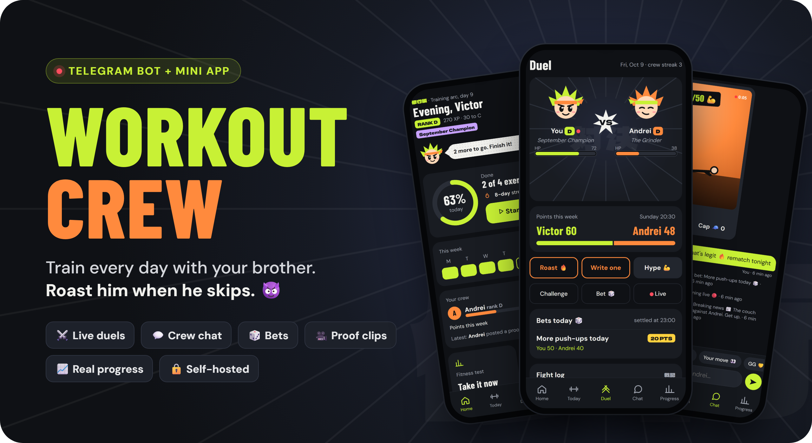
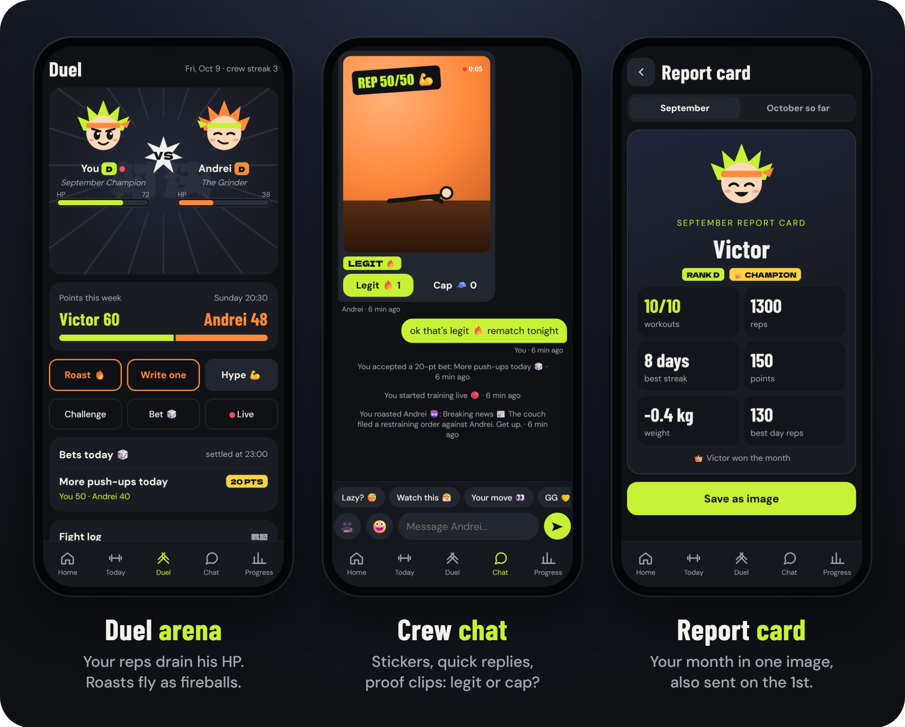
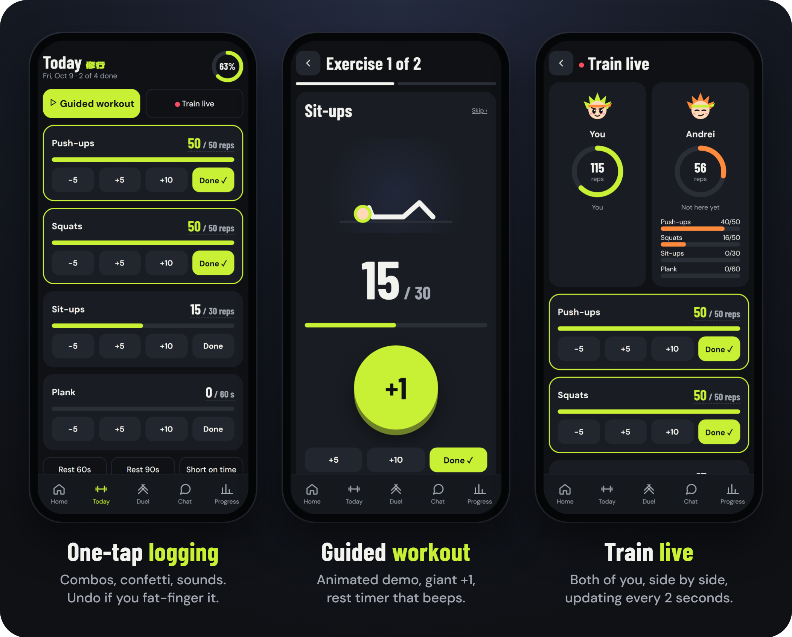
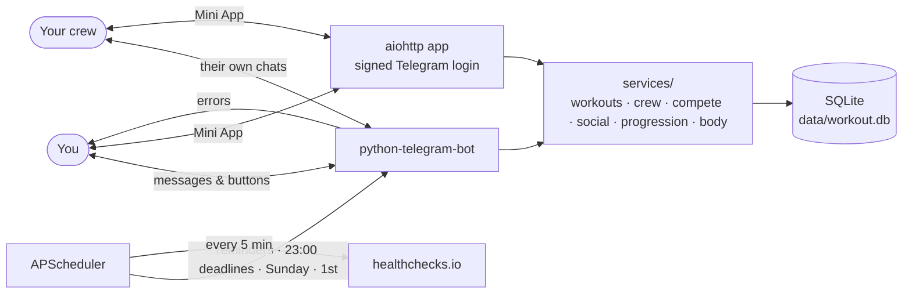

<p align="center">
  
</p>

<p align="center">
  
  
  
  
  
  
</p>

<h3 align="center">Daily bodyweight workouts that you actually do,<br>because your brother is watching. 👀</h3>

<p align="center">
  A self-hosted Telegram bot with a full app inside Telegram: live duels, crew chat, bets, proof clips,<br>
  targets that adapt to you, and monthly tests that prove you're getting stronger. Your data never leaves your server.
</p>

<p align="center">
  <a href="#-quick-start"><b>Quick start</b></a> ·
  <a href="#-what-it-does">Features</a> ·
  <a href="#-commands">Commands</a> ·
  <a href="#-run-it-247-on-a-server">Deploy</a> ·
  <a href="#-faq">FAQ</a>
</p>

---

## ⚔️ Compete like it matters

<p align="center">
  
</p>

Every rep you log **drains your brother's HP** in the arena, live. Fall behind and he gets a ping: *"⚡ Victor just passed you: 120 vs 100 reps"*, with a **Revenge** button. Bet 20 points that you'll do more push-ups today, back it up with a 5-second **proof clip**, and let him rule it 🔥 legit or 🧢 cap. On Sunday the loser does the forfeit.

## 🏋️ Every workout counts

<p align="center">
  
</p>

Tap **+5** and watch the number pop, chain a **combo**, finish with confetti. Or press **Start** and the guided workout walks you through it: an animated demo of each move, a giant +1 button, a rest timer that beeps. Want company? **Train live** and see each other's reps every 2 seconds.

---

## 💡 Why this one?

| | |
| :--- | :--- |
| 👥 **It's social without being social media** | Just you and the people you invite (up to 6). A duel, a chat, roasts, bets. No followers, no feed of strangers. |
| 🎯 **It adapts to you** | Tell it a workout was *too easy* or *too hard* and your targets change. After a break it eases you back in at 70% → 85% → 100%. Skill ladders turn 60 push-ups into diamond push-ups. |
| 🧪 **It proves you're changing** | A 10-minute fitness test on the 1st of every month (*push-ups 18 → 24 → 31*), weekly weight trends and private then-and-now photos. Real numbers, not just streaks. |
| 🎮 **It's fun to open** | An anime layer you can switch off: a mascot that breathes and jumps on every rep, ranks E → S, unlockable gear, monthly champion titles. |
| 🛡 **It runs for years** | Verified backups, error reports in Telegram, an outside alarm if the server dies, and 315 automated tests. |
| 🔒 **It's yours** | One SQLite file on your server. No AI, no API keys, no tracking, no subscription. |

---

## 📅 A day with your crew

| When | What happens |
| :--- | :--- |
| **06:30** | ☀️ Wake-up check: tap the right number within 10 minutes. Your brother sees *on time ✅* or *42 min late 🐢*. |
| **07:00** | Today's workout arrives. Log it in the chat with one tap, or open the app and press **Start**. |
| **During the day** | The duel updates live. *"🏁 Andrei just finished. Your move 👀"*. Roast him, hype him, challenge him, bet on it. |
| **19:00** if not done | A streak-saver nudge listing only what's left. |
| **21:00** | 🤖 Auto-roast if your crew trained and you didn't. |
| **23:00** | Challenges and bets are settled automatically. |
| **Sunday 20:30** | 🏆 Weekly points: the winner is crowned and picks the loser's forfeit (50 extra push-ups, cold shower…). |
| **1st of the month** | 🧪 Fitness test, 👑 season champion, 📊 your report card. |

---

## ✨ What it does

### 📱 The app (inside Telegram)
- **Home, Today, Duel, Chat, Progress:** swipe between them, pull down to refresh. Everything works without typing a command.
- **It feels alive:** your mascot breathes, blinks, jumps on every rep, sweats near the finish and sulks if it's late. Big +5 numbers, combos, confetti, sounds, haptics.
- **Duel arena:** your training drains their HP and theirs drains yours. A roast flies over as a fireball 🔥. Ghost pace shows where your brother was *yesterday* at this time.
- **Crew chat:** messages, mascot stickers, quick replies (*"Lazy? 😴"*), and a Telegram ping only when they're not in the app.
- **Proof clips:** a short video or photo of your last rep. 🔥 legit = +3 points, 🧢 cap = −5. Clips are deleted after 30 days.
- **Bets:** 5, 10 or 20 points on *more push-ups today*, *more total reps* or *who finishes first*.
- **Train live:** both of you on one screen, reps and rest timers updating every 2 seconds.
- **Guided workout:** one exercise at a time with an animated demo, a giant +1 button and rest countdowns.
- **Progression:** XP and ranks from E to S, unlockable hair, headbands and auras, monthly seasons with a champion title.
- **Body change:** skill ladders, weight and waist trends, **private** progress photos with then-and-now.
- **Monthly report card:** your month on one shareable image.
- **No chat needed:** settings, exercise editor, exact amounts with Undo, the fitness test with a built-in timer, tap any calendar day to see what you did.
- **🛠 Admin (owner only):** open any member's day, any date, and fix it: reps, targets, skip, complete or reset a day, change their plan. Every correction shows in the fight log with your reason, and they get a message, so nobody can say you cheated.

### 💬 The bot (in the chat)
- **One-tap logging:** *Complete All*, `+1 / +5 / +10 / +25`, exact amounts, skip, **⏱ Short on Time** (half targets, still counts), snooze.
- **Timers:** 60 s / 90 s rest and plank timers that ping you when time is up (they survive restarts).
- **Adapts:** difficulty feedback (*too easy* twice → +10%, *too hard* → −10%), a comeback ramp after breaks, optional auto-progression.
- **Progress:** monthly fitness test with `▁▄█ 18 → 24 → 31` trend charts, weekly summary vs last week, 🔥 streaks that rest and paused days never break, badges, CSV export, and a 4-week heatmap:
  ```text
   M   T   W   T   F   S   S
  🟩  🟩  🟩  🟩  🟩  ⬜  🟩
  🟩  🟩  🟨  🟩  🟦  🟦  🟦
  🟩  🟩  ⏳  ▫️  ▫️  ▫️  ▫️
  ```
- **Crew mode:** single-use invite links, everyone with their own workouts, reminder time, timezone and streak. Live feed, `/duel`, roast and hype (savage, friendly or off: each person decides what they receive), wake-up challenge, weekly points, challenges and forfeits.
- **Points:** workout +10 · full targets +5 · woke on time +5 · challenge +15 · test PR +20 · forfeit done +5 · legit proof +3 (cap −5) · bets ± stake.
- **Accountability partner:** a friend who gets only what you share (weekly summary, test results, an alert after 3 missed workouts) and can send one 👏 high-five a day.
- **🏖 Vacation / sick pause:** 3 days to 60 days, streak frozen, reminders off.

<p align="center">
  
</p>

### 🛡 Runs itself
- **Verified backups:** weekly to your Telegram chat, each restore-tested against the live data; the last 10 are kept on disk.
- **Error reports in Telegram:** rate limited, so you never need to read server logs.
- **📡 Outside alarm:** pings a free [healthchecks.io](https://healthchecks.io) check, which emails you if the server goes silent.
- **`/status`:** uptime, running version, button clicks received, next reminders, last backup. A **"Bot started"** message on every restart makes a crash loop obvious.

---

## 🚀 Quick start

**You need:** Python 3.11+, a bot token from [@BotFather](https://t.me/botfather), and your numeric Telegram ID from [@userinfobot](https://t.me/userinfobot).

```bash
git clone https://github.com/vicuvi1/Sport-Bot-Telegram-.git
cd Sport-Bot-Telegram-
python3 -m venv .venv && source .venv/bin/activate   # Windows: .venv\Scripts\Activate.ps1
pip install -r requirements.txt
cp .env.example .env                                  # then fill it in (below)
python main.py
```

```env
TELEGRAM_BOT_TOKEN=1234567890:ABCdefGHIjklMNOpqrsTUVwxyz
TELEGRAM_USER_ID=123456789
TIMEZONE=Europe/Chisinau
WORKOUT_TIME=07:00
HEALTHCHECK_URL=            # optional, see "Outside alarm" below
WEBAPP_URL=                 # optional, https address for the Mini App (see below)
```

Open your bot in Telegram and send **`/start`**. Then **`/crew`** → **Invite** to bring your brother in. 🎉

**Just want to see the app?** `python -m webapp.dev` and open http://localhost:8090: the real app with a sample two-person crew, no Telegram needed.

---

## 🕹 Commands

| Command | What it does |
| :--- | :--- |
| `/today` | Today's workout with progress bars and logging buttons |
| `/progress` · `/stats` | Stats for today, this week, this month, all time |
| `/history` | 4-week heatmap and recent workouts |
| `/summary` | This week's summary on demand |
| `/test` | Monthly fitness test and your progress history |
| `/crew` · `/duel` | Your crew, invites, roast / hype · today's scoreboard |
| `/wake` | Wake-up challenge: on/off and time |
| `/points` · `/challenge` | Weekly points and forfeits · challenge a crew mate |
| `/partner` | Invite or manage your accountability partner (owner) |
| `/pause` | Vacation / sick pause |
| `/badges` | Milestones and badges |
| `/settings` | Reminder time, timezone, exercises, targets, progression |
| `/export` · `/backup` | CSV export · database backup sent to the chat |
| `/status` | Health check |
| `/cancel` · `/help` | Leave a prompt · help |

---

## 🐧 Run it 24/7 on a server

<details>
<summary><b>Ubuntu + systemd setup</b> (auto-start on boot, auto-restart on crash)</summary>

```bash
sudo mkdir -p /opt/workout-bot && sudo chown -R $USER:$USER /opt/workout-bot
git clone https://github.com/vicuvi1/Sport-Bot-Telegram-.git /opt/workout-bot
cd /opt/workout-bot
python3 -m venv .venv && ./.venv/bin/pip install -r requirements.txt
cp .env.example .env && nano .env

sudo cp workout-bot.service /etc/systemd/system/   # edit User=/Group= if not "ubuntu"
sudo systemctl daemon-reload
sudo systemctl enable --now workout-bot
journalctl -u workout-bot -f                        # live logs
```

**Updating:** `git pull && sudo systemctl restart workout-bot`. The database upgrades itself on startup and keeps your history.
</details>

<details>
<summary><b>📱 Mini App: the app screen inside Telegram</b></summary>

The bot serves the app on `127.0.0.1:8080`; [Caddy](https://caddyserver.com) puts it on HTTPS (Telegram requires it) and renews the certificate automatically.

1. Point a domain (or a free DuckDNS name) at the server's IP.
2. `sudo apt install -y caddy`, then put this in `/etc/caddy/Caddyfile` and `sudo systemctl reload caddy`:
   ```
   app.yourdomain.com {
       encode gzip
       reverse_proxy 127.0.0.1:8080
   }
   ```
3. In `.env`: `WEBAPP_HOST=127.0.0.1` and `WEBAPP_URL=https://app.yourdomain.com`, then restart the bot.
4. An **App** button appears next to the message box in Telegram. Opening `https://app.yourdomain.com` in a normal browser shows a demo with sample data.

**Work on the app on your PC:** `python -m webapp.dev`, then open http://localhost:8090. It runs the real code on its own sample database (`data/dev.db`) and never contacts Telegram: messages the bot would send are printed in the terminal. Add `?as=2` to see your brother's side; `--reset` starts the sample data over. `node scripts/readme_images.mjs` regenerates the screenshots on this page.
</details>

<details>
<summary><b>📡 Outside alarm</b> (get an email if the server dies)</summary>

1. Create a free check at [healthchecks.io](https://healthchecks.io): **period 5 minutes**, **grace 15 minutes**, email notifications on.
2. Put its ping URL (`https://hc-ping.com/…`) in `HEALTHCHECK_URL` in `.env` and restart the bot.
3. `/status` shows **📡 Outside alarm: ✅ OK** within a minute. If the bot can't reach Telegram it pings `/fail`, so you're alerted even while the server is up.
</details>

<details>
<summary><b>After an Ubuntu release upgrade</b></summary>

A major upgrade replaces the system Python, which breaks the bot's virtualenv. Rebuild it with one command (your data is untouched):

```bash
cd /opt/workout-bot && ./scripts/rebuild_venv.sh
```
</details>

<details>
<summary><b>Troubleshooting: buttons do nothing</b></summary>

If typed messages work but inline buttons only spin:

1. **Two copies are running** with the same token. The bot logs `CONFLICT` and messages you a warning. Find the other copy: `ps aux | grep main.py`.
2. **Old code is running.** Compare `/status`'s version with `git log -1 --oneline`, then pull and restart.
3. **A stale update filter on the token.** The bot always requests every update type when it starts, which clears it.

Every button click is logged as `LIVE CALLBACK RECEIVED`, and `/status` counts them.
</details>

---

## 🏗 How it's built



- **Python 3.11+**, `python-telegram-bot` 22, `APScheduler` 3, `aiohttp`, SQLite. Pinned dependencies for long-term stability.
- **The app is plain JavaScript:** no framework, no build step, no npm. Every API call carries Telegram's signed login data, checked on the server.
- **315 tests** cover crew isolation, the multi-user migration, streaks, pauses, the comeback ramp, the fitness test, chat, bets, proof clips, overtake alerts, admin corrections, app login, backups and button routing. Run them with `pytest -q`.

---

## ❓ FAQ

<details>
<summary><b>Who can use my bot?</b></summary>

Only you (`TELEGRAM_USER_ID`) and the crew members you invite with a single-use link (up to 6 people). Each member sees their own data plus the crew's duel, chat and points. Weight, waist and progress photos are private: never shown to anyone else. Everyone else is ignored.
</details>

<details>
<summary><b>Does it use AI or send my data anywhere?</b></summary>

No AI, no API keys, no analytics. Your data stays in `data/workout.db` on your machine. The only outside service is the optional healthchecks.io ping, which carries no workout data.
</details>

<details>
<summary><b>Do I need the Mini App?</b></summary>

No. Everything important works in the chat. The app needs a public HTTPS address (a free DuckDNS name plus Caddy, see above); it adds the arena, chat, bets, proof clips, live training, the guided workout and the anime layer.
</details>

<details>
<summary><b>Can I change the exercises?</b></summary>

Yes: in the app (**Settings → Edit exercises**) or in the chat (`/settings` → *Manage Exercises & Targets*). Add, remove or pause exercises, change targets and pick days. The defaults are push-ups, squats, sit-ups and plank.
</details>

---

<p align="center">
  <br><br>
  MIT licensed · If it gets you training, ⭐ the repo!
</p>
