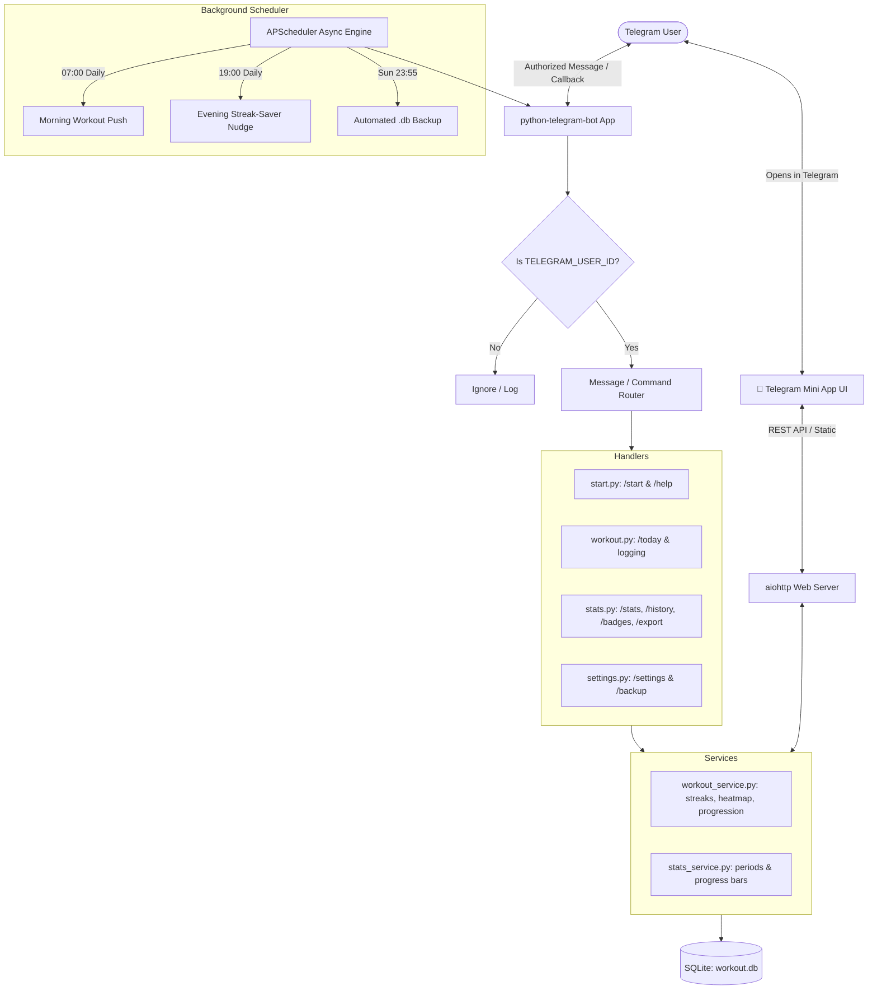

# 🏋️ Telegram Workout Tracker Bot

<p align="center">
  
  
  
  
  
  
</p>

<p align="center">
  <b>A private, high-reliability Telegram bot to track daily bodyweight workouts, build unbreakable habits, monitor streaks, and level up your fitness.</b>
</p>

---

## 🌟 Why This Bot?

Most workout apps are bloated with paid subscriptions, complex UI, or unnecessary AI chat integrations. This bot is engineered to be **lightweight, private, and zero-friction**:

- 🔒 **Private & Secure:** Only your configured `TELEGRAM_USER_ID` can interact with the bot. All other Telegram users are completely ignored.
- ⚡ **Zero AI Dependencies:** 100% deterministic, robust Python logic. No API keys from OpenAI, Claude, or Gemini required.
- 💾 **Local First & Self-Hosted:** Data lives in a local SQLite file (`data/workout.db`). Includes one-tap manual backups and automated weekly Sunday backups delivered directly to your Telegram chat.
- ⏱ **Frictionless Logging:** Complete your workout in **1 tap** with *Complete All as Scheduled*, or use quick increment buttons (`+5`, `+10`, `+25`), built-in rest timers, and plank countdown alerts.

---

## ✨ Features at a Glance

### 1. 🏋️ Morning Workouts & Smart Logging
* **Automated Morning Delivery:** Automatically receives today's workout plan at your preferred hour (default `07:00` in `Europe/Chisinau`).
* **Live Progress Indicators:** Visual Unicode progress bars for each exercise (`[████████░░] 80%`).
* **1-Tap Fast-Track:** `[⚡ Complete All as Scheduled]` marks all daily targets completed in a single click.
* **Granular Controls:** Increment/decrement buttons (`➕ +5`, `➕ +10`, `➖ -5`), quick target done, custom amount input (e.g. entered `65` on target `50`), or skip.
* **Built-in Rest & Stopwatch Timers:** Tap `[⏱ 60s Rest]` or `[⏱ 90s Rest]` to trigger background timers with alert notifications when your rest interval finishes.

### 2. 📅 4-Week GitHub-Style Heatmap & History
Review your workout consistency in `/history` or `/stats` with a visual calendar grid:
```text
📅 Workout Heatmap (Last 4 Weeks)

` M   T   W   T   F   S   S`
 🟩  🟩  🟩  🟩  🟩  ⬜  🟩
 🟩  🟩  🟨  🟩  🟩  🟩  🟩
 🟩  🟩  🟩  🟩  🟩  ⬜  🟩
 🟩  🟩  ⏳  ▫️  ▫️  ▫️  ▫️

Legend:
🟩 Done   🟨 Partial   ⬜ Rest
🟥 Missed ⏳ Today     ▫️ Future
```

### 3. 🔥 Intelligent Streak Engine
* Calculates **Current Streak** and **All-Time Best Streak**.
* **Rest Days Never Break Streaks:** Scheduled rest days preserve your hard-earned streak without penalties.
* **In-Progress Protection:** An incomplete workout today does not break your streak while the day is still active.

### 4. 🏆 Gamification & Milestones (`/badges`)
Track lifetime fitness milestones with built-in badges:
- 🌱 **First Step:** Complete your first workout.
- 🔥 **Consistent 7:** Achieve a 7-day workout streak.
- 🏆 **Iron Habit 30:** Achieve a 30-day streak.
- 🥉 **Century Club:** Complete 100 reps of any exercise.
- 🥇 **Titan 1,000:** Reach 1,000 total lifetime repetitions.
- ⚡ **Early Bird:** Finish a workout before 09:00 AM.
- 🛡️ **Weekend Warrior:** Log workouts on both Saturday and Sunday.

### 5. ⏰ Evening Streak-Saver Nudges & Habit Reminders
* At **19:00 (7 PM)**, if today's workout is still pending, the bot sends a gentle nudge with only the unfinished exercises so you never drop a streak.
* Includes a `[💤 Snooze 1h]` option on morning notifications.

### 6. 🚀 Optional Auto-Progression
* When enabled, successfully completing an exercise across consecutive workouts (e.g., 3 workouts in a row) automatically increases its target by a configurable percentage (e.g., +5%).

### 7. 📤 Data Export & Backups
* **`/export` Command:** Export your complete workout history into an Excel/Google Sheets-ready `.csv` file.
* **Weekly Automated Backups:** APScheduler sends a backup of `workout.db` to your Telegram chat every Sunday night.
* **On-Demand Backup:** Download your database anytime via `/backup` or the Settings menu.

### 8. 📱 Telegram Mini App (Web App Interface)
* **Native Mobile Experience:** Clicking `📱 Open Workout App` in the main menu opens a dark-mode mobile interface directly inside Telegram.
* **Animated Circular Progress Dial:** Real-time SVG circular meter displaying overall daily completion and streak flame.
* **Interactive Exercise Cards:** Smooth cards with mini progress bars, fast `+5` / `+10` rep adjusters, and 1-tap completion.
* **Built-in Stopwatch with Haptic Feedback:** Live countdown timer for plank/timed sets with vibrating haptic pulses (`Telegram.WebApp.HapticFeedback`).
* **Instant Two-Way Sync:** Automatically syncs with the SQLite database via the embedded `aiohttp` REST API and `Telegram.WebApp.sendData`.

---

## 🏗 System Architecture



---

## 🕹 Command Reference

| Command | Button | Description |
| :--- | :--- | :--- |
| `/start` | — | Initializes the bot, checks authorization, displays welcome card and main menu |
| `/today` | 🏋️ Today's Workout | Shows today's workout card, progress bars, and logging actions |
| `/progress` or `/stats` | 📊 Progress | Period summary (Today, This Week, This Month, All Time) |
| `/history` | 📅 History | 4-week visual heatmap calendar + recent workout activity |
| `/badges` | 🏆 Milestones | Displays unlocked and in-progress milestone badges |
| `/export` | 📤 Export CSV | Sends your complete workout log as a `.csv` spreadsheet file |
| `/settings` | ⚙️ Settings | Configure time, timezone, auto-progression, exercises, and notifications |
| `/backup` | 💾 Backup Data | Generates a timestamped `.db` SQLite backup sent to chat |
| `/help` | — | Quick user guide and command breakdown |

---

## 🚀 Quick Start Guide

### Prerequisites
- Python 3.11+ (Python 3.11, 3.12, 3.13, 3.14 supported)
- A Telegram account and a Bot Token from [@BotFather](https://t.me/botfather)

### 1. Clone the Repository
```bash
git clone https://github.com/vicuvi1/Sport-Bot-Telegram-.git
cd Sport-Bot-Telegram-
```

### 2. Create Virtual Environment
#### Linux / macOS:
```bash
python3 -m venv .venv
source .venv/bin/activate
```
#### Windows (PowerShell):
```powershell
python -m venv .venv
.\.venv\Scripts\Activate.ps1
```

### 3. Install Dependencies
```bash
pip install -r requirements.txt
```

### 4. Configure Environment Variables
Copy `.env.example` to `.env`:
```bash
cp .env.example .env
```
Edit `.env` with your preferred editor:
```env
TELEGRAM_BOT_TOKEN=1234567890:ABCdefGHIjklMNOpqrsTUVwxyz
TELEGRAM_USER_ID=1900611848
TIMEZONE=Europe/Chisinau
WORKOUT_TIME=07:00
```
> **Tip:** You can obtain your numeric `TELEGRAM_USER_ID` by messaging [@userinfobot](https://t.me/userinfobot) on Telegram.

### 5. Run the Bot
```bash
python main.py
```
Open Telegram, search for your bot username, and send `/start`!

---

## 🧪 Running Automated Tests

Run the complete 24-test suite with `pytest`:
```bash
pytest -v
```

All core domain logic is verified:
- ✅ Streak calculations across consecutive days, rest days, and missed days
- ✅ Automatic progression (+5% target scaling after consecutive completions)
- ✅ Period statistics aggregation and Unicode progress bar formatting
- ✅ 4-week GitHub-style heatmap rendering
- ✅ Badge and milestone evaluations
- ✅ SQLite backup integrity and CSV export generation

---

## 🐧 Production Ubuntu Deployment (systemd)

To run the bot 24/7 on an Ubuntu VPS with automatic startup on boot and auto-restart on crashes:

1. Copy the project to `/opt/workout-bot`:
   ```bash
   sudo mkdir -p /opt/workout-bot
   sudo chown -R $USER:$USER /opt/workout-bot
   cp -r . /opt/workout-bot/
   cd /opt/workout-bot
   ```

2. Set up virtualenv and install dependencies:
   ```bash
   python3 -m venv .venv
   ./.venv/bin/pip install -r requirements.txt
   ```

3. Ensure `/opt/workout-bot/.env` is configured.

4. Install the provided systemd service:
   ```bash
   sudo cp workout-bot.service /etc/systemd/system/
   sudo systemctl daemon-reload
   sudo systemctl enable workout-bot
   sudo systemctl start workout-bot
   ```

5. Monitor status and logs:
   ```bash
   # Check service status
   sudo systemctl status workout-bot

   # Tail live logs
   journalctl -u workout-bot -f
   ```

---

## 🛡️ Security & Privacy

- **Single-User Lock:** The bot compares every incoming request against `TELEGRAM_USER_ID`. Unauthorized users are discarded and cannot access or manipulate your workout data.
- **Git Safety:** `.gitignore` excludes `.env`, `*.db`, and `.venv` so credentials and personal database records are never exposed.

---

## 📄 License

This project is licensed under the [MIT License](LICENSE).
